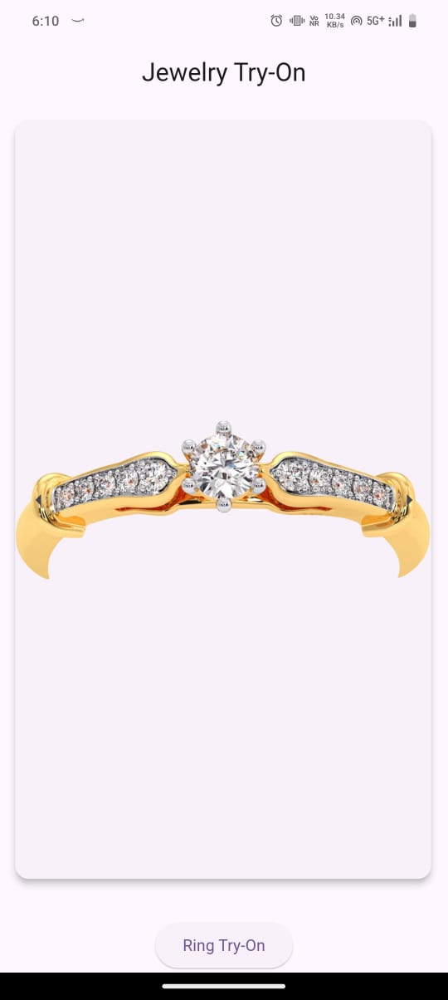
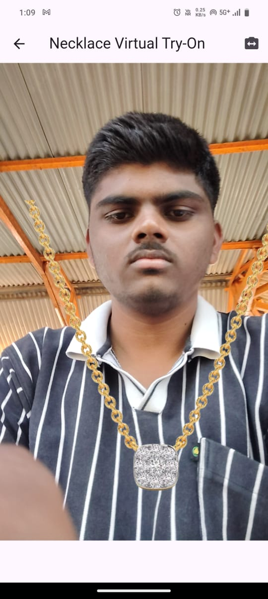

# Jewellery Try-On Using google_ml_kit

## Overview

This is a Flutter application that allows users to virtually try on various types of jewelry, such as rings, necklaces, earrings, and bracelets.

## Features

- Virtual try-on experience for rings, necklaces, earrings, and bracelets
- Easy-to-use interface with a selection of jewelry images to apply to a user’s live image or camera feed

## Setup

### Prerequisites

1. **Install Flutter:** Make sure Flutter is installed on your machine. You can find instructions for installation [here](https://flutter.dev/docs/get-started/install).

2. **Set up Google ML Kit:**
   - Add `google_ml_kit` to your Flutter project by including it in your `pubspec.yaml` file:
     ```yaml
     dependencies:
       google_ml_kit: ^latest_version
     ```
   - Run `flutter pub get` to install the package.
   
3. **Clone the Repository:**
   - Clone this repository to your local machine using:
     ```bash
     git clone <repository-url>
     cd <repository-folder>
     ```

### How to Run

1. **Run flutter pub get:**
   - Inside the project folder, run:
     ```bash
     flutter pub get
     ```

2. **Connect a device or start an emulator:**
   - Ensure you have a physical device connected via USB with developer mode enabled or start an Android/iOS emulator.

3. **Run the app:**
   - Use the following command to start the application:
     ```bash
     flutter run
     ```

## Screenshots



